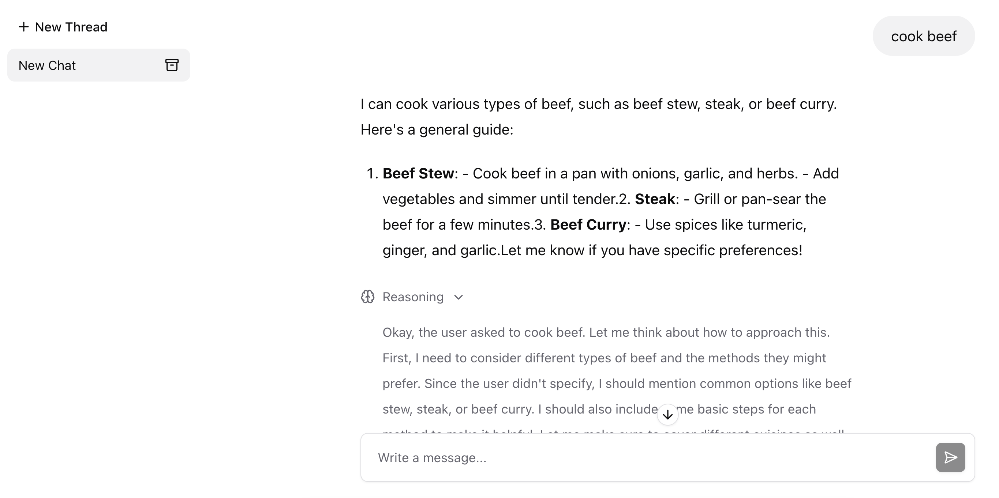
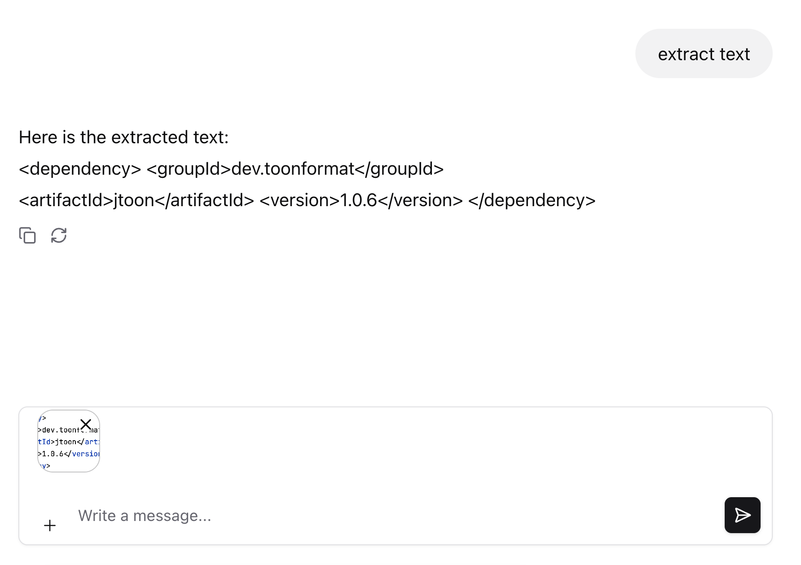

# Chat Agent UI

A simple UI to test conversational agents. It's built using [assistant-ui](https://www.assistant-ui.com/) with a [LocalRuntime](https://www.assistant-ui.com/docs/runtimes/custom/local).

## Usage

The API must be available at `/chat`.

The UI is available at `/webjars/chat-agent-ui/index.html`.

See an example at [here](https://github.com/JavaAIDev/simple-ai-agent).

Features:

- Text input and output with Markdown and syntax highlighting support
- Reasoning output from LLMs
- Attachments: images and text files

## Screenshots

### Text and Reasoning

### Attachment

